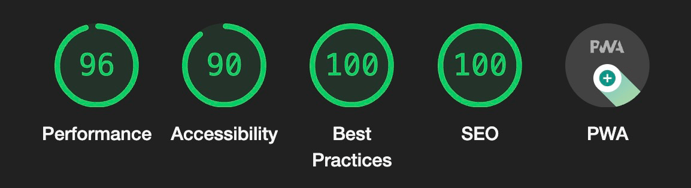
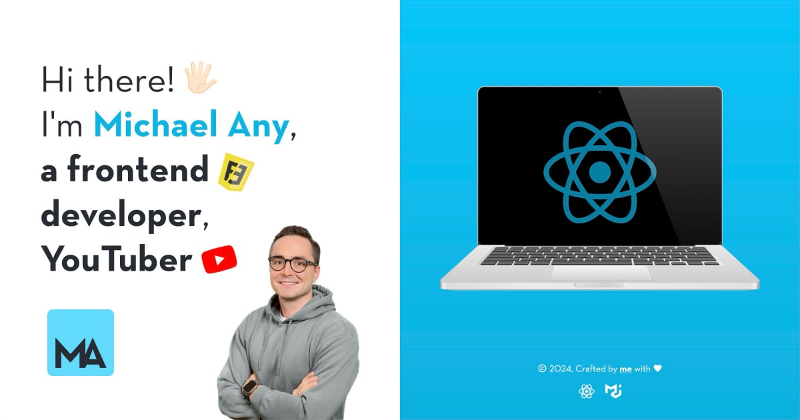

  

<h1 align="center">Michael Any</h1>

## Hi there! 👋 I'm [Michael Any][website] 🦸‍♂️ Lead Frontend Engineer 👨‍💻 [YouTuber][youtube] 📹

## [About](https://michaelany.com/#/about)

- 🚀 &nbsp;Creating [projects](https://michaelany.com/#/portfolio) of any complexity from scratch
- 💡 &nbsp;Bringing UI/UX ideas to life
- 💼 &nbsp;9 years of [experience](https://michaelany.com/#/experience)
- 📹 &nbsp;Have my own [vlog](https://michaelany.com/#/vlog) on [YouTube][youtube]
- 🇳🇿 &nbsp;Based in Auckland, New Zealand

  
🔽 &nbsp;<strong>More</strong>

- 👔 &nbsp;Organized & standalone
- 🤓 &nbsp;Love to code
- 🌱 &nbsp;Constantly learning
- 📐 &nbsp;Prone to perfectionism
- 🎓 &nbsp;Two higher educations
- 🎭 &nbsp;Former professional actor
- 🏃‍♂️ &nbsp;Sports lover
- ⛰ &nbsp;Traveler
- 👫 &nbsp;Happy husband
- ☕️ &nbsp;Coffee lover

&nbsp;

[][website]
[][youtube]
[][linkedin]

[][7glyphs]
[][instagram]

## [Skills](https://michaelany.com/#/skills)

- 👾 &nbsp;Crafting [applications](https://michaelany.com/#/portfolio#app), [multi-page sites](https://michaelany.com/#/portfolio#site), [landing pages](https://michaelany.com/#/portfolio#landing) & [admin panels](https://michaelany.com/#/portfolio#admin)
- 🛠 &nbsp;Favorite stack is `TypeScript` + `React` + `React Query` + `Material UI`
- 🏎 &nbsp;Writing modern & productive code
- 🎨 &nbsp;Creating semantic, cross-browser & pixel-perfect markup
- 🎬 &nbsp;Creating [YouTube videos](https://www.youtube.com/@michaelany/videos) in Final Cut Pro

  
🔽 &nbsp;<strong>More</strong>

- ✅ &nbsp;Creating reliable & well-functioning interfaces
- 🧠 &nbsp;Choosing a simple way to solve the problem
- 🧩 &nbsp;Using a lot of patterns & techniques
- 🧱 &nbsp;Building a modular & optimal project architecture
- 🔧 &nbsp;Using modern frameworks, libraries, and tools
- 📱 &nbsp;Implementing responsive interface & animations
- 🧹 &nbsp;Following a consistent code style
- 🔬 &nbsp;Optimizing, testing & refactoring
- 📒 &nbsp;Planing & decomposing tasks
- 🐣 &nbsp;Making code reviews & teaching

&nbsp;

## [Contact](https://michaelany.com/#/contact)

Do you need my **help**? Have a **suggestion** for me? Send a mail to michaelany.it@gmail.com or use links below:

[][linkedin]

## GitHub Analytics

---

## About this project

- 🚀 &nbsp;This project is a `SPA` (Single-page App) & `PWA` (Progressive Web App)
- ⚙️ &nbsp;Using `Vite` with custom configuration as the project builder and development server
- 🔧 &nbsp;Base dependencies: `typescript`, `react`, `react-router-dom`, `@mui/material`, `sass`
- ✅ &nbsp;All `HTML` is semantic and accessible, and you can navigate fully using the keyboard
- 🎨 &nbsp;Styled with `BEM` React style naming convention
- 📱 &nbsp;Responsive markup tested on every pixel of the screen width
- 🎞 &nbsp;Uses my own scroll animation component `Animate` for the `CSS` animations
- 🇺🇸 &nbsp;Supports English & Russian languages, used `react-i18next`
- 📨 &nbsp;Uses `EmailJS` & `reCaptcha` to send contact form emails
- 🗄 &nbsp;Some UI data stores in the `localStorage`
- 🧹 &nbsp;Clean & unified code style, also use `prettier` & `eslint`
- 🌄 &nbsp;All images optimized & ready for retina
- 🔨 &nbsp;Base tools used: `Visual Studio Code`, `Chrome DevTools`, `Sketch`, `ImageOptim`, `macOS Sonoma`
- 💪🏻 &nbsp;Everything is done by myself: design, code, texts, integrations, deployment etc.
- 🏎 &nbsp;Google Page Speed score `~96`:

  

---

  

[website]: https://michaelany.com
[linkedin]: https://www.linkedin.com/in/michaelany
[youtube]: https://www.youtube.com/@michaelany
[instagram]: https://instagram.com/anymichael
[7glyphs]: https://7glyphs.com/agency/team
[facebook]: https://www.facebook.com/michaelany.fb
[vk]: https://vk.com/michaelany
