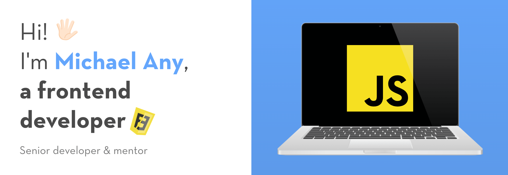

  

<h1 align="center">Michael Any</h1>

## Hi! 👋 &nbsp;I'm [Michael Any](website), a frontend developer 👨‍💻

## [About](https://michaelany.com/about)

- 👨‍💻 &nbsp;I'm engaged in frontend development
- 🚀 &nbsp;I create beautiful & convenient [projects](https://michaelany.com/portfolio) of any complexity
- 💡 &nbsp;Bringing UI/UX ideas to life
- 💼 &nbsp;5+ years of [experience](https://michaelany.com/experience)
- 👨‍🏫 &nbsp;Senior developer & mentor

  
🔽 &nbsp;<strong>Details</strong>

- 👔 &nbsp;Organized & standalone
- 🤓 &nbsp;Love to code
- 🌱 &nbsp;Constantly evolving
- 📐 &nbsp;Prone to perfectionism
- 🎓 &nbsp;Two higher educations
- 🏃‍♂️ &nbsp;Sports lover
- ⛰ &nbsp;Traveler
- 👫 &nbsp;Happy husband
- ☕️ &nbsp;Coffee lover

&nbsp;

## [Skills](https://michaelany.com/skills)

- 👾 &nbsp;I develop applications, landing pages, multi-page sites & admin panels
- 🛠 &nbsp;My main stack is `TypeScript` + `React` + `Redux`
- ✅ &nbsp;Create reliable & well-functioning interfaces
- 🏎 &nbsp;Write modern & productive code
- 🎨 &nbsp;Create semantic, accessible, cross-browser & Pixel Perfect markup

  
🔽 &nbsp;<strong>Details</strong>

- 🧠 &nbsp;Choose a simple & effective way to solve the problem
- 🧩 &nbsp;Use a large number of patterns & techniques
- 🧱 &nbsp;Build a modular & optimal project architecture
- 🔧 &nbsp;Use modern frameworks, libraries, and tools
- 📱 &nbsp;Implement responsive interface & animations
- 🧹 &nbsp;Follow a single style of writing clean code
- 🔬 &nbsp;Refactor, optimize & test
- 📒 &nbsp;Planning, decomposing & documenting
- 🐣 &nbsp;Make code reviews & teach

&nbsp;

## [Contact](https://michaelany.com/contact)

Do you need my help? Or have a suggestion for me? Send me a mail to michael.any.dev@gmail.com or use links below:

## GitHub Analytics

[website]: https://michaelany.com
[linkedin]: https://linkedin.com/mclananiev
[instagram]: https://instagram.com/mclananiev
[facebook]: https://facebook.com/mclananiev
[vk]: https://vk.com/mclananiev
